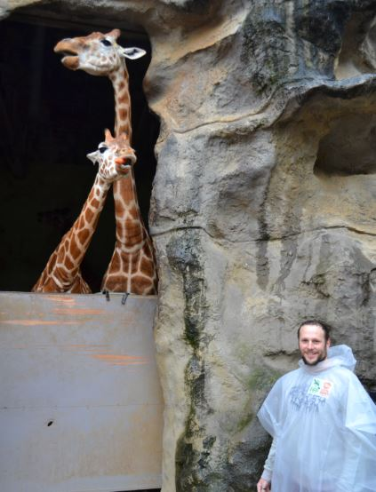
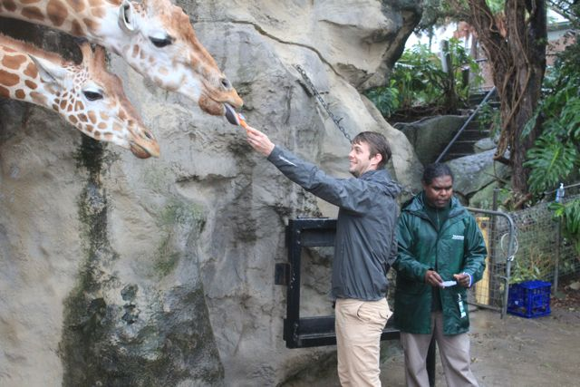
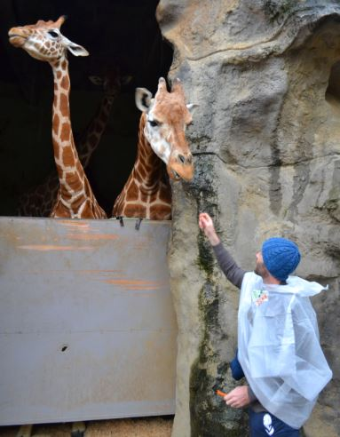

BEES R User Group
---
Informal style tutorials on data analysis in the R language, as well as general ecological computing, 
run out of the Centre for Ecosystem Science:  
http://www.ecosystem.unsw.edu.au/

Get on the mailing list for extra material and updates:  
https://www.lists.unsw.edu.au/mailman/listinfo/bees-ecocomp

### When?
*alternate Fridays 12-1pm in rm 640 of the Biology building*

#### Upcoming sessions:

17 April: writing functions - Mitch L  
https://github.com/enterthesloth/BEES-ecocomp/blob/master/intoToFunctions.R

#### Past sessions:  
27 March: Species traits in multivariate analysis - Ecostats session with David W  
http://www.eco-stats.blogspot.com.au/2015/03/species-traits-in-multivariate-analysis.html  

20 February: R coding 101 - Mitch L  
https://github.com/andrewletten/BEES-ecocomp/blob/master/RScripting101.R  

5 December: Distance-based statistics in R (with Vegan) - Shaun N  
https://github.com/enterthesloth/BEES-ecocomp/tree/master/vegan  

21 November: CANAPE (Categorical Analysis of Neo and Palaeo Endemism) with Biodiverse - Shawn L  
http://biodiverse-analysis-software.blogspot.com.au/2014/11/canape-categorical-analysis-of-palaeo.html  

7 November: BEES end-of-year party, yiew!  

31 October: Inference with spatially correlated data (with mixed effects models) - Ecostats session with Gordana P  
http://eco-stats.blogspot.com.au/2014/10/r-lab-inference-with-spatially.html  

10 October: Raster and Vector handling in R - Nick M  
https://github.com/enterthesloth/BEES-ecocomp/tree/master/Rasters  

26 September: Break due to school holidays  

12 September: Plotting in R with the ggplot2 package - Ned H  
https://github.com/enterthesloth/BEES-ecocomp/blob/master/ggplot_tutorial.Rmd  

29 August: Mixed modelling - Ecostats session with Francis H  
http://eco-stats.blogspot.com.au/2014/08/r-lab-on-mixed-models-in-ecology.html  

1 August: Advanced streamlined data manipulation in R with dplyr - Eve S  
Tutorial by Hadley Wickham:  
http://rpubs.com/hadley/dplyr-intro  
Additional excercises:  
https://github.com/enterthesloth/BEES-ecocomp/blob/master/dplyr.R

4 July: Break due to conferences, school holidays, semester break etc.

18 July: Break due to conferences, school holidays, semester break etc.

20 June: regex - Andrew L  
https://www.dropbox.com/s/k0kxzoktqvtn95l/regex_tutorial.pdf  

6 June: HPC with Katana - Mitch L  
https://www.dropbox.com/s/2c41r47qzgenl11/Katana.pdf  

23 May: writing functions - Mitch L  
https://github.com/enterthesloth/BEES-ecocomp/blob/master/intoToFunctions.R

9 May: version control with git - Will C  
http://wcornwell.github.io/versionControl/git_intro.html#1  

4 April: basic data manipulation in R - Andrew L  
https://github.com/enterthesloth/BEES-ecocomp/tree/master/subset

15 March: loops and logical operators in R - Mitch L  
https://github.com/enterthesloth/BEES-ecocomp/blob/master/introToLoops.R
