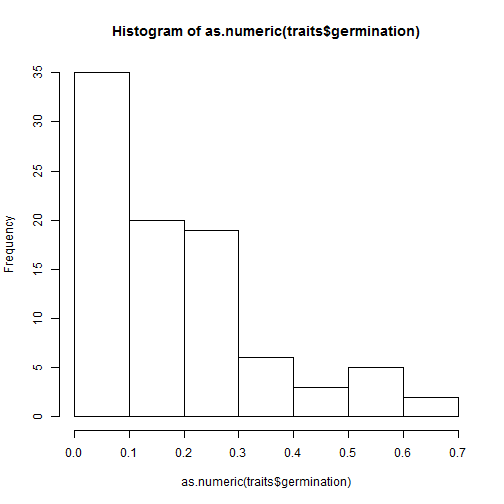

Subsetting in R: a very brief intro...
========================================================

First things first, this is an R Markdown document.

Markdown is a simple formatting syntax that you can use to do wonderful things e.g. authoring dynamic documents exactly like this one. More on this later, but for now all that really matters is that all the instructions for this tutorial are provided in plain text while the actual executable R-code is given in the greyed-out code blocks. Please note that for now you can ignore the first and last lines of each code block (backward ticks, curly backwards etc. is not executable R-code).

First thing we're going to do is load in some data. If you haven't already, click on 'Session' in the Rstudio toolbar and set working directory "To Source File Location" (assuming you've saved this document and the data in the same place).

Now run the single line of code below (ctrl+enter). 


```r
traits <- read.csv("haba_traits.csv", header = TRUE, na.strings = "")
```


Getting to know your data better and betterer...


```r
str(traits)
```

```
## 'data.frame':	90 obs. of  8 variables:
##  $ X            : int  1 5 11 13 15 21 29 31 35 37 ...
##  $ status       : Factor w/ 2 levels "introduced","native": 1 2 2 1 1 1 2 1 2 1 ...
##  $ species      : Factor w/ 90 levels "Acer rubrum",..: 18 32 41 28 30 29 47 58 89 4 ...
##  $ germination  : num  0.11 0.3155 0.29 0.0526 0.0614 ...
##  $ earlysurvival: num  0.91 0.971 0.949 0.918 0.847 ...
##  $ adulthood    : num  0.000323 0.1008 0.27209 0.370812 NA ...
##  $ lifehistory  : Factor w/ 3 levels "annual","biennial",..: 1 1 1 1 1 1 1 1 1 2 ...
##  $ life_form    : Factor w/ 2 levels "nonwoody","woody": 1 NA NA NA NA NA 1 1 1 NA ...
```

```r
colnames(traits)
```

```
## [1] "X"             "status"        "species"       "germination"  
## [5] "earlysurvival" "adulthood"     "lifehistory"   "life_form"
```

```r
dim(traits)
```

```
## [1] 90  8
```

```r
summary(traits)
```

```
##        X              status                   species    germination    
##  Min.   :  1   introduced:26   Acer rubrum         : 1   Min.   :0.0005  
##  1st Qu.: 79   native    :64   Achillea millefolium: 1   1st Qu.:0.0432  
##  Median :182                   Agropyron cristatum : 1   Median :0.1682  
##  Mean   :168                   Alliaria petiolata  : 1   Mean   :0.1829  
##  3rd Qu.:253                   Andropogon gayanus  : 1   3rd Qu.:0.2641  
##  Max.   :341                   Anthyllis vulneraria: 1   Max.   :0.6100  
##                                (Other)             :84                   
##  earlysurvival     adulthood       lifehistory    life_form 
##  Min.   :0.000   Min.   :0.00   annual   : 9   nonwoody: 8  
##  1st Qu.:0.893   1st Qu.:0.06   biennial : 5   woody   : 9  
##  Median :0.949   Median :0.21   perennial:76   NA's    :73  
##  Mean   :0.886   Mean   :0.24                               
##  3rd Qu.:0.975   3rd Qu.:0.37                               
##  Max.   :0.999   Max.   :0.76                               
##                  NA's   :77
```

```r
head(traits)
```

```
##    X     status                    species germination earlysurvival
## 1  1 introduced             Carduus nutans     0.11000        0.9097
## 2  5     native            Collinsia verna     0.31550        0.9705
## 3 11     native      Euphrasia officinalis     0.29000        0.9491
## 4 13 introduced     Centaurea solstitialis     0.05259        0.9181
## 5 15 introduced Chrysanthemum leucanthemum     0.06140        0.8466
## 6 21 introduced           Centaurea stoebe     0.06150        0.6501
##   adulthood lifehistory life_form
## 1 0.0003234      annual  nonwoody
## 2 0.1008000      annual      <NA>
## 3 0.2720896      annual      <NA>
## 4 0.3708120      annual      <NA>
## 5        NA      annual      <NA>
## 6        NA      annual      <NA>
```

```r
hist(as.numeric(traits$germination))
```

 


As you can see 'traits' is a dataframe comprising individual trait data for 90 plant species.

To access individual variables (columns) in R the most flexible approach is to use bracket notation where the first index is for rows and the second for columns i.e. [R,C]. If we want to access all the observations (rows) in one column we leave the first index blank.


```r
traits[, 2]
```

```
##  [1] introduced native     native     introduced introduced introduced
##  [7] native     introduced native     introduced introduced introduced
## [13] introduced introduced native     native     native     introduced
## [19] introduced introduced introduced native     native     native    
## [25] native     native     native     native     native     native    
## [31] native     native     native     native     native     native    
## [37] native     native     native     native     native     native    
## [43] native     native     introduced native     introduced native    
## [49] native     native     native     native     native     native    
## [55] introduced native     native     native     native     native    
## [61] native     native     native     introduced introduced native    
## [67] introduced native     native     native     native     introduced
## [73] native     introduced native     native     native     native    
## [79] native     introduced native     native     native     introduced
## [85] native     introduced native     native     native     introduced
## Levels: introduced native
```

```r
traits$germination
```

```
##  [1] 0.1100000 0.3155000 0.2900000 0.0525915 0.0614000 0.0615000 0.1836000
##  [8] 0.2644444 0.0220000 0.0327655 0.1700000 0.1728533 0.3624837 0.2163745
## [15] 0.0004921 0.0195000 0.0360080 0.0010500 0.2003462 0.6100000 0.1997900
## [22] 0.0160000 0.0330000 0.5770000 0.2470000 0.0171000 0.2337512 0.0420000
## [29] 0.1750000 0.2857143 0.5200000 0.1902551 0.3147000 0.2060580 0.0916769
## [36] 0.0212660 0.2031000 0.2750000 0.0154000 0.0213500 0.1270935 0.3673823
## [43] 0.5053333 0.2430000 0.1959184 0.1605000 0.1665000 0.0553000 0.0854000
## [50] 0.1115000 0.1073000 0.0285000 0.0060000 0.5075000 0.4651042 0.0210000
## [57] 0.5665000 0.0050000 0.2500000 0.2630000 0.2390000 0.1012500 0.6043484
## [64] 0.0065000 0.0580000 0.1349000 0.0333333 0.1000000 0.0966667 0.1830000
## [71] 0.1200000 0.2900000 0.1866667 0.0205000 0.2699000 0.0870000 0.2667300
## [78] 0.4362500 0.0549000 0.0274000 0.4450000 0.1078000 0.0470000 0.3293231
## [85] 0.0418500 0.0120000 0.2000000 0.2499000 0.2242500 0.3797050
```


Or vice versa, if we want to access all the observations in one row we leave the second index blank.


```r
traits[7, ]
```

```
##    X status               species germination earlysurvival adulthood
## 7 29 native Heterotheca latifolia      0.1836        0.9526        NA
##   lifehistory life_form
## 7      annual  nonwoody
```


How about if we wanted to subset different observations from different variables? The code block below generates a number of different subsets. Before running each line of code, try workout what each one is doing...


```r
traits[1:6, ]
```

```
##    X     status                    species germination earlysurvival
## 1  1 introduced             Carduus nutans     0.11000        0.9097
## 2  5     native            Collinsia verna     0.31550        0.9705
## 3 11     native      Euphrasia officinalis     0.29000        0.9491
## 4 13 introduced     Centaurea solstitialis     0.05259        0.9181
## 5 15 introduced Chrysanthemum leucanthemum     0.06140        0.8466
## 6 21 introduced           Centaurea stoebe     0.06150        0.6501
##   adulthood lifehistory life_form
## 1 0.0003234      annual  nonwoody
## 2 0.1008000      annual      <NA>
## 3 0.2720896      annual      <NA>
## 4 0.3708120      annual      <NA>
## 5        NA      annual      <NA>
## 6        NA      annual      <NA>
```

```r
traits[12, 3]
```

```
## [1] Echium vulgare
## 90 Levels: Acer rubrum Achillea millefolium ... Vincetoxicum rossicum
```

```r
traits[, c(2, 4)]
```

```
##        status germination
## 1  introduced   0.1100000
## 2      native   0.3155000
## 3      native   0.2900000
## 4  introduced   0.0525915
## 5  introduced   0.0614000
## 6  introduced   0.0615000
## 7      native   0.1836000
## 8  introduced   0.2644444
## 9      native   0.0220000
## 10 introduced   0.0327655
## 11 introduced   0.1700000
## 12 introduced   0.1728533
## 13 introduced   0.3624837
## 14 introduced   0.2163745
## 15     native   0.0004921
## 16     native   0.0195000
## 17     native   0.0360080
## 18 introduced   0.0010500
## 19 introduced   0.2003462
## 20 introduced   0.6100000
## 21 introduced   0.1997900
## 22     native   0.0160000
## 23     native   0.0330000
## 24     native   0.5770000
## 25     native   0.2470000
## 26     native   0.0171000
## 27     native   0.2337512
## 28     native   0.0420000
## 29     native   0.1750000
## 30     native   0.2857143
## 31     native   0.5200000
## 32     native   0.1902551
## 33     native   0.3147000
## 34     native   0.2060580
## 35     native   0.0916769
## 36     native   0.0212660
## 37     native   0.2031000
## 38     native   0.2750000
## 39     native   0.0154000
## 40     native   0.0213500
## 41     native   0.1270935
## 42     native   0.3673823
## 43     native   0.5053333
## 44     native   0.2430000
## 45 introduced   0.1959184
## 46     native   0.1605000
## 47 introduced   0.1665000
## 48     native   0.0553000
## 49     native   0.0854000
## 50     native   0.1115000
## 51     native   0.1073000
## 52     native   0.0285000
## 53     native   0.0060000
## 54     native   0.5075000
## 55 introduced   0.4651042
## 56     native   0.0210000
## 57     native   0.5665000
## 58     native   0.0050000
## 59     native   0.2500000
## 60     native   0.2630000
## 61     native   0.2390000
## 62     native   0.1012500
## 63     native   0.6043484
## 64 introduced   0.0065000
## 65 introduced   0.0580000
## 66     native   0.1349000
## 67 introduced   0.0333333
## 68     native   0.1000000
## 69     native   0.0966667
## 70     native   0.1830000
## 71     native   0.1200000
## 72 introduced   0.2900000
## 73     native   0.1866667
## 74 introduced   0.0205000
## 75     native   0.2699000
## 76     native   0.0870000
## 77     native   0.2667300
## 78     native   0.4362500
## 79     native   0.0549000
## 80 introduced   0.0274000
## 81     native   0.4450000
## 82     native   0.1078000
## 83     native   0.0470000
## 84 introduced   0.3293231
## 85     native   0.0418500
## 86 introduced   0.0120000
## 87     native   0.2000000
## 88     native   0.2499000
## 89     native   0.2242500
## 90 introduced   0.3797050
```


That's all very simple, but what now if want to subset the dataset based on specific criteria, e.g. only select species that are introduced? We still use the bracket notation but with the added help of logical expressions. 


```r
unique(traits$status)
```

```
## [1] introduced native    
## Levels: introduced native
```

```r
traits[traits$status == "native", ]
```

```
##      X status                     species germination earlysurvival
## 2    5 native             Collinsia verna   0.3155000        0.9705
## 3   11 native       Euphrasia officinalis   0.2900000        0.9491
## 7   29 native       Heterotheca latifolia   0.1836000        0.9526
## 9   35 native           Veronica arvensis   0.0220000        0.9549
## 15  53 native        Araucaria hunsteinii   0.0004921        0.9851
## 16  56 native      Araucaria cunninghamii   0.0195000        0.9444
## 17  59 native       Astrocaryum mexicanum   0.0360080        0.9354
## 22  76 native        Achillea millefolium   0.0160000        0.0000
## 23  78 native       Arrhenatherum elatius   0.0330000        0.9562
## 24  82 native            Ranunculus acris   0.5770000        0.8104
## 25  86 native         Centaurea corymbosa   0.2470000        0.9564
## 26  89 native        Carpinus caroliniana   0.0171000        0.9758
## 27  91 native           Banksia attenuata   0.2337512        0.9923
## 28  93 native            Lupinus arboreus   0.0420000        0.9441
## 29  99 native        Anthyllis vulneraria   0.1750000        0.9458
## 30 100 native        Cecropia obtusifolia   0.2857143        0.0000
## 31 107 native            Avicennia marina   0.5200000        0.9927
## 32 108 native          Banksia ericifolia   0.1902551        0.9553
## 33 114 native     Liquidambar styraciflua   0.3147000        0.9504
## 34 115 native          Banksia hookeriana   0.2060580        0.9819
## 35 117 native        Petrophile pulchella   0.0916769        0.9758
## 36 123 native             Ulmus davidiana   0.0212660        0.9565
## 37 135 native             Prunus serotina   0.2031000        0.9824
## 38 138 native                 Acer rubrum   0.2750000        0.9580
## 39 143 native             Nyssa sylvatica   0.0154000        0.9726
## 40 149 native               Festuca rubra   0.0213500        0.9728
## 41 152 native          Tsuga heterophylla   0.1270935        0.8351
## 42 155 native       Pseudotsuga menziesii   0.3673823        0.9298
## 43 158 native            Pinus sylvestris   0.5053333        0.8147
## 44 162 native               Picea mariana   0.2430000        0.8844
## 46 189 native          Berchemia scandens   0.1605000        0.9978
## 48 196 native            Carpinus cordata   0.0553000        0.9099
## 49 197 native           Carpinus japonica   0.0854000        0.8701
## 50 198 native          Carpinus laxiflora   0.1115000        0.9054
## 51 199 native        Carpinus tschonoskii   0.1073000        0.8700
## 52 200 native             Centaurea nigra   0.0285000        0.9527
## 53 205 native          Cirsium scopulorum   0.0060000        0.4847
## 54 207 native            Cordia alliodora   0.5075000        0.8579
## 56 215 native           Danthonia spicata   0.0210000        0.9561
## 57 218 native       Desmodium paniculatum   0.5665000        0.9767
## 58 222 native Elaeocarpus photiniaefolius   0.0050000        0.9031
## 59 224 native          Erianthemum dregei   0.2500000        0.4555
## 60 229 native        Faramea occidentalis   0.2630000        0.9737
## 61 230 native              Ficus stupenda   0.2390000        0.8880
## 62 231 native            Frasera speciosa   0.1012500        0.9101
## 63 236 native           Hakea polyanthema   0.6043484        0.9939
## 66 250 native   Lithospermum caroliniense   0.1349000        0.6076
## 68 253 native             Lueha seemannii   0.1000000        0.9385
## 69 259 native             Miconia affinis   0.0966667        0.9424
## 70 260 native            Miconia gracilis   0.1830000        0.9313
## 71 261 native             Miconia nervosa   0.1200000        0.9587
## 73 265 native          Ochroma pyramidale   0.1866667        0.8587
## 75 271 native               Olea europaea   0.2699000        0.9555
## 76 272 native           Oxalis acetosella   0.0870000        0.9944
## 77 276 native         Phillyrea latifolia   0.2667300        0.9225
## 78 278 native             Pinus banksiana   0.4362500        0.9410
## 79 280 native            Pinus monophylla   0.0549000        0.9268
## 81 306 native         Ranunculus bulbosus   0.4450000        0.5554
## 82 307 native           Ranunculus repens   0.1078000        0.8353
## 83 309 native               Rhus radicans   0.0470000        0.9946
## 85 313 native               Rumex acetosa   0.0418500        0.9702
## 87 315 native               Salvia lyrata   0.2000000        0.9842
## 88 320 native           Shorea stenoptera   0.2499000        0.8256
## 89 330 native       Tachigalia versicolor   0.2242500        0.8896
##    adulthood lifehistory life_form
## 2  0.1008000      annual      <NA>
## 3  0.2720896      annual      <NA>
## 7         NA      annual  nonwoody
## 9         NA      annual  nonwoody
## 15 0.0009753   perennial      <NA>
## 16 0.0164978   perennial      <NA>
## 17 0.0554448   perennial     woody
## 22        NA   perennial      <NA>
## 23        NA   perennial      <NA>
## 24        NA   perennial  nonwoody
## 25        NA   perennial      <NA>
## 26        NA   perennial      <NA>
## 27        NA   perennial      <NA>
## 28        NA   perennial      <NA>
## 29        NA   perennial      <NA>
## 30        NA   perennial      <NA>
## 31        NA   perennial      <NA>
## 32        NA   perennial     woody
## 33        NA   perennial      <NA>
## 34        NA   perennial      <NA>
## 35        NA   perennial      <NA>
## 36        NA   perennial      <NA>
## 37        NA   perennial     woody
## 38        NA   perennial      <NA>
## 39        NA   perennial      <NA>
## 40        NA   perennial      <NA>
## 41        NA   perennial      <NA>
## 42        NA   perennial      <NA>
## 43        NA   perennial      <NA>
## 44        NA   perennial      <NA>
## 46        NA   perennial      <NA>
## 48        NA   perennial      <NA>
## 49        NA   perennial      <NA>
## 50        NA   perennial      <NA>
## 51        NA   perennial      <NA>
## 52        NA   perennial      <NA>
## 53        NA   perennial      <NA>
## 54        NA   perennial      <NA>
## 56        NA   perennial      <NA>
## 57        NA   perennial      <NA>
## 58        NA   perennial      <NA>
## 59        NA   perennial      <NA>
## 60        NA   perennial      <NA>
## 61        NA   perennial      <NA>
## 62        NA   perennial      <NA>
## 63        NA   perennial      <NA>
## 66        NA   perennial  nonwoody
## 68        NA   perennial      <NA>
## 69        NA   perennial     woody
## 70        NA   perennial     woody
## 71        NA   perennial      <NA>
## 73        NA   perennial      <NA>
## 75        NA   perennial      <NA>
## 76        NA   perennial  nonwoody
## 77        NA   perennial      <NA>
## 78        NA   perennial      <NA>
## 79        NA   perennial      <NA>
## 81        NA   perennial      <NA>
## 82        NA   perennial      <NA>
## 83        NA   perennial      <NA>
## 85        NA   perennial      <NA>
## 87        NA   perennial      <NA>
## 88        NA   perennial      <NA>
## 89        NA   perennial     woody
```


Some more examples (inclduing the use of and/or statements):


```r
trait2 = traits[traits$germination >= 0.2, ]
traits[traits$germination >= 0.2 & traits$status == "introduced", ]
```

```
##      X     status               species germination earlysurvival
## 8   31 introduced Microstegium vimineum      0.2644        0.8361
## 13  46 introduced   Picris hieracioides      0.3625        0.9542
## 14  49 introduced     Verbascum thapsus      0.2164        0.9529
## 19  64 introduced     Ardisia elliptica      0.2003        0.9948
## 20  72 introduced       Syzygium jambos      0.6100        0.9932
## 55 214 introduced    Cynara cardunculus      0.4651        0.9862
## 72 262 introduced          Mimosa pigra      0.2900        0.9537
## 84 311 introduced           Rosa rugosa      0.3293        0.9751
## 90 341 introduced Vincetoxicum rossicum      0.3797        0.9973
##    adulthood lifehistory life_form
## 8         NA      annual  nonwoody
## 13        NA    biennial      <NA>
## 14        NA    biennial      <NA>
## 19    0.1079   perennial      <NA>
## 20    0.5859   perennial      <NA>
## 55        NA   perennial  nonwoody
## 72        NA   perennial     woody
## 84        NA   perennial      <NA>
## 90        NA   perennial     woody
```

```r
traits[traits$germination >= 0.3 | traits$earlysurvival <= 0.9, ]
```

```
##      X     status                    species germination earlysurvival
## 2    5     native            Collinsia verna     0.31550        0.9705
## 5   15 introduced Chrysanthemum leucanthemum     0.06140        0.8466
## 6   21 introduced           Centaurea stoebe     0.06150        0.6501
## 8   31 introduced      Microstegium vimineum     0.26444        0.8361
## 13  46 introduced        Picris hieracioides     0.36248        0.9542
## 20  72 introduced            Syzygium jambos     0.61000        0.9932
## 22  76     native       Achillea millefolium     0.01600        0.0000
## 24  82     native           Ranunculus acris     0.57700        0.8104
## 30 100     native       Cecropia obtusifolia     0.28571        0.0000
## 31 107     native           Avicennia marina     0.52000        0.9927
## 33 114     native    Liquidambar styraciflua     0.31470        0.9504
## 41 152     native         Tsuga heterophylla     0.12709        0.8351
## 42 155     native      Pseudotsuga menziesii     0.36738        0.9298
## 43 158     native           Pinus sylvestris     0.50533        0.8147
## 44 162     native              Picea mariana     0.24300        0.8844
## 49 197     native          Carpinus japonica     0.08540        0.8701
## 51 199     native       Carpinus tschonoskii     0.10730        0.8700
## 53 205     native         Cirsium scopulorum     0.00600        0.4847
## 54 207     native           Cordia alliodora     0.50750        0.8579
## 55 214 introduced         Cynara cardunculus     0.46510        0.9862
## 57 218     native      Desmodium paniculatum     0.56650        0.9767
## 59 224     native         Erianthemum dregei     0.25000        0.4555
## 61 230     native             Ficus stupenda     0.23900        0.8880
## 63 236     native          Hakea polyanthema     0.60435        0.9939
## 66 250     native  Lithospermum caroliniense     0.13490        0.6076
## 67 252 introduced           Lonicera maackii     0.03333        0.8257
## 73 265     native         Ochroma pyramidale     0.18667        0.8587
## 78 278     native            Pinus banksiana     0.43625        0.9410
## 80 284 introduced              Poa compressa     0.02740        0.0000
## 81 306     native        Ranunculus bulbosus     0.44500        0.5554
## 82 307     native          Ranunculus repens     0.10780        0.8353
## 84 311 introduced                Rosa rugosa     0.32932        0.9751
## 88 320     native          Shorea stenoptera     0.24990        0.8256
## 89 330     native      Tachigalia versicolor     0.22425        0.8896
## 90 341 introduced      Vincetoxicum rossicum     0.37970        0.9973
##    adulthood lifehistory life_form
## 2     0.1008      annual      <NA>
## 5         NA      annual      <NA>
## 6         NA      annual      <NA>
## 8         NA      annual  nonwoody
## 13        NA    biennial      <NA>
## 20    0.5859   perennial      <NA>
## 22        NA   perennial      <NA>
## 24        NA   perennial  nonwoody
## 30        NA   perennial      <NA>
## 31        NA   perennial      <NA>
## 33        NA   perennial      <NA>
## 41        NA   perennial      <NA>
## 42        NA   perennial      <NA>
## 43        NA   perennial      <NA>
## 44        NA   perennial      <NA>
## 49        NA   perennial      <NA>
## 51        NA   perennial      <NA>
## 53        NA   perennial      <NA>
## 54        NA   perennial      <NA>
## 55        NA   perennial  nonwoody
## 57        NA   perennial      <NA>
## 59        NA   perennial      <NA>
## 61        NA   perennial      <NA>
## 63        NA   perennial      <NA>
## 66        NA   perennial  nonwoody
## 67        NA   perennial      <NA>
## 73        NA   perennial      <NA>
## 78        NA   perennial      <NA>
## 80        NA   perennial      <NA>
## 81        NA   perennial      <NA>
## 82        NA   perennial      <NA>
## 84        NA   perennial      <NA>
## 88        NA   perennial      <NA>
## 89        NA   perennial     woody
## 90        NA   perennial     woody
```


Or perhaps we want all species that aren't 'introduced'.


```r
traits[traits$status != "introduced", ]
```

```
##      X status                     species germination earlysurvival
## 2    5 native             Collinsia verna   0.3155000        0.9705
## 3   11 native       Euphrasia officinalis   0.2900000        0.9491
## 7   29 native       Heterotheca latifolia   0.1836000        0.9526
## 9   35 native           Veronica arvensis   0.0220000        0.9549
## 15  53 native        Araucaria hunsteinii   0.0004921        0.9851
## 16  56 native      Araucaria cunninghamii   0.0195000        0.9444
## 17  59 native       Astrocaryum mexicanum   0.0360080        0.9354
## 22  76 native        Achillea millefolium   0.0160000        0.0000
## 23  78 native       Arrhenatherum elatius   0.0330000        0.9562
## 24  82 native            Ranunculus acris   0.5770000        0.8104
## 25  86 native         Centaurea corymbosa   0.2470000        0.9564
## 26  89 native        Carpinus caroliniana   0.0171000        0.9758
## 27  91 native           Banksia attenuata   0.2337512        0.9923
## 28  93 native            Lupinus arboreus   0.0420000        0.9441
## 29  99 native        Anthyllis vulneraria   0.1750000        0.9458
## 30 100 native        Cecropia obtusifolia   0.2857143        0.0000
## 31 107 native            Avicennia marina   0.5200000        0.9927
## 32 108 native          Banksia ericifolia   0.1902551        0.9553
## 33 114 native     Liquidambar styraciflua   0.3147000        0.9504
## 34 115 native          Banksia hookeriana   0.2060580        0.9819
## 35 117 native        Petrophile pulchella   0.0916769        0.9758
## 36 123 native             Ulmus davidiana   0.0212660        0.9565
## 37 135 native             Prunus serotina   0.2031000        0.9824
## 38 138 native                 Acer rubrum   0.2750000        0.9580
## 39 143 native             Nyssa sylvatica   0.0154000        0.9726
## 40 149 native               Festuca rubra   0.0213500        0.9728
## 41 152 native          Tsuga heterophylla   0.1270935        0.8351
## 42 155 native       Pseudotsuga menziesii   0.3673823        0.9298
## 43 158 native            Pinus sylvestris   0.5053333        0.8147
## 44 162 native               Picea mariana   0.2430000        0.8844
## 46 189 native          Berchemia scandens   0.1605000        0.9978
## 48 196 native            Carpinus cordata   0.0553000        0.9099
## 49 197 native           Carpinus japonica   0.0854000        0.8701
## 50 198 native          Carpinus laxiflora   0.1115000        0.9054
## 51 199 native        Carpinus tschonoskii   0.1073000        0.8700
## 52 200 native             Centaurea nigra   0.0285000        0.9527
## 53 205 native          Cirsium scopulorum   0.0060000        0.4847
## 54 207 native            Cordia alliodora   0.5075000        0.8579
## 56 215 native           Danthonia spicata   0.0210000        0.9561
## 57 218 native       Desmodium paniculatum   0.5665000        0.9767
## 58 222 native Elaeocarpus photiniaefolius   0.0050000        0.9031
## 59 224 native          Erianthemum dregei   0.2500000        0.4555
## 60 229 native        Faramea occidentalis   0.2630000        0.9737
## 61 230 native              Ficus stupenda   0.2390000        0.8880
## 62 231 native            Frasera speciosa   0.1012500        0.9101
## 63 236 native           Hakea polyanthema   0.6043484        0.9939
## 66 250 native   Lithospermum caroliniense   0.1349000        0.6076
## 68 253 native             Lueha seemannii   0.1000000        0.9385
## 69 259 native             Miconia affinis   0.0966667        0.9424
## 70 260 native            Miconia gracilis   0.1830000        0.9313
## 71 261 native             Miconia nervosa   0.1200000        0.9587
## 73 265 native          Ochroma pyramidale   0.1866667        0.8587
## 75 271 native               Olea europaea   0.2699000        0.9555
## 76 272 native           Oxalis acetosella   0.0870000        0.9944
## 77 276 native         Phillyrea latifolia   0.2667300        0.9225
## 78 278 native             Pinus banksiana   0.4362500        0.9410
## 79 280 native            Pinus monophylla   0.0549000        0.9268
## 81 306 native         Ranunculus bulbosus   0.4450000        0.5554
## 82 307 native           Ranunculus repens   0.1078000        0.8353
## 83 309 native               Rhus radicans   0.0470000        0.9946
## 85 313 native               Rumex acetosa   0.0418500        0.9702
## 87 315 native               Salvia lyrata   0.2000000        0.9842
## 88 320 native           Shorea stenoptera   0.2499000        0.8256
## 89 330 native       Tachigalia versicolor   0.2242500        0.8896
##    adulthood lifehistory life_form
## 2  0.1008000      annual      <NA>
## 3  0.2720896      annual      <NA>
## 7         NA      annual  nonwoody
## 9         NA      annual  nonwoody
## 15 0.0009753   perennial      <NA>
## 16 0.0164978   perennial      <NA>
## 17 0.0554448   perennial     woody
## 22        NA   perennial      <NA>
## 23        NA   perennial      <NA>
## 24        NA   perennial  nonwoody
## 25        NA   perennial      <NA>
## 26        NA   perennial      <NA>
## 27        NA   perennial      <NA>
## 28        NA   perennial      <NA>
## 29        NA   perennial      <NA>
## 30        NA   perennial      <NA>
## 31        NA   perennial      <NA>
## 32        NA   perennial     woody
## 33        NA   perennial      <NA>
## 34        NA   perennial      <NA>
## 35        NA   perennial      <NA>
## 36        NA   perennial      <NA>
## 37        NA   perennial     woody
## 38        NA   perennial      <NA>
## 39        NA   perennial      <NA>
## 40        NA   perennial      <NA>
## 41        NA   perennial      <NA>
## 42        NA   perennial      <NA>
## 43        NA   perennial      <NA>
## 44        NA   perennial      <NA>
## 46        NA   perennial      <NA>
## 48        NA   perennial      <NA>
## 49        NA   perennial      <NA>
## 50        NA   perennial      <NA>
## 51        NA   perennial      <NA>
## 52        NA   perennial      <NA>
## 53        NA   perennial      <NA>
## 54        NA   perennial      <NA>
## 56        NA   perennial      <NA>
## 57        NA   perennial      <NA>
## 58        NA   perennial      <NA>
## 59        NA   perennial      <NA>
## 60        NA   perennial      <NA>
## 61        NA   perennial      <NA>
## 62        NA   perennial      <NA>
## 63        NA   perennial      <NA>
## 66        NA   perennial  nonwoody
## 68        NA   perennial      <NA>
## 69        NA   perennial     woody
## 70        NA   perennial     woody
## 71        NA   perennial      <NA>
## 73        NA   perennial      <NA>
## 75        NA   perennial      <NA>
## 76        NA   perennial  nonwoody
## 77        NA   perennial      <NA>
## 78        NA   perennial      <NA>
## 79        NA   perennial      <NA>
## 81        NA   perennial      <NA>
## 82        NA   perennial      <NA>
## 83        NA   perennial      <NA>
## 85        NA   perennial      <NA>
## 87        NA   perennial      <NA>
## 88        NA   perennial      <NA>
## 89        NA   perennial     woody
```


Or perhaps we're really interested in introduced species with a poor germination fraction but a high rate of early survival...


```r
traits[traits$status == "introduced" & traits$germination <= 0.1 & traits$earlysurvival >= 
    0.95, ]
```

```
##      X     status               species germination earlysurvival
## 18  60 introduced     Cytisus scoparius     0.00105        0.9678
## 65 244 introduced       Larix kaempferi     0.05800        0.9871
## 74 269 introduced Oenothera glazioviana     0.02050        0.9786
##    adulthood lifehistory life_form
## 18    0.2365   perennial     woody
## 65        NA   perennial      <NA>
## 74        NA   perennial      <NA>
```


There are also times where we might want to remove all observations/sites/records without data for a particular variable, and we do this using the 'is.na()' function.

The 'lifehistory' variable has a substantial number of missing datapoints.


```r
is.na(traits$adulthood)
```

```
##  [1] FALSE FALSE FALSE FALSE  TRUE  TRUE  TRUE  TRUE  TRUE FALSE FALSE
## [12]  TRUE  TRUE  TRUE FALSE FALSE FALSE FALSE FALSE FALSE FALSE  TRUE
## [23]  TRUE  TRUE  TRUE  TRUE  TRUE  TRUE  TRUE  TRUE  TRUE  TRUE  TRUE
## [34]  TRUE  TRUE  TRUE  TRUE  TRUE  TRUE  TRUE  TRUE  TRUE  TRUE  TRUE
## [45]  TRUE  TRUE  TRUE  TRUE  TRUE  TRUE  TRUE  TRUE  TRUE  TRUE  TRUE
## [56]  TRUE  TRUE  TRUE  TRUE  TRUE  TRUE  TRUE  TRUE  TRUE  TRUE  TRUE
## [67]  TRUE  TRUE  TRUE  TRUE  TRUE  TRUE  TRUE  TRUE  TRUE  TRUE  TRUE
## [78]  TRUE  TRUE  TRUE  TRUE  TRUE  TRUE  TRUE  TRUE  TRUE  TRUE  TRUE
## [89]  TRUE  TRUE
```


To remove all the observations with missing data for seedbank we use:


```r
traits[!is.na(traits$adulthood), ]
```

```
##     X     status                species germination earlysurvival
## 1   1 introduced         Carduus nutans   0.1100000        0.9097
## 2   5     native        Collinsia verna   0.3155000        0.9705
## 3  11     native  Euphrasia officinalis   0.2900000        0.9491
## 4  13 introduced Centaurea solstitialis   0.0525915        0.9181
## 10 37 introduced     Alliaria petiolata   0.0327655        0.9490
## 11 40 introduced     Centaurea maculosa   0.1700000        0.9760
## 15 53     native   Araucaria hunsteinii   0.0004921        0.9851
## 16 56     native Araucaria cunninghamii   0.0195000        0.9444
## 17 59     native  Astrocaryum mexicanum   0.0360080        0.9354
## 18 60 introduced      Cytisus scoparius   0.0010500        0.9678
## 19 64 introduced      Ardisia elliptica   0.2003462        0.9948
## 20 72 introduced        Syzygium jambos   0.6100000        0.9932
## 21 73 introduced    Agropyron cristatum   0.1997900        0.9967
##    adulthood lifehistory life_form
## 1  0.0003234      annual  nonwoody
## 2  0.1008000      annual      <NA>
## 3  0.2720896      annual      <NA>
## 4  0.3708120      annual      <NA>
## 10 0.2062129    biennial      <NA>
## 11 0.4263418    biennial      <NA>
## 15 0.0009753   perennial      <NA>
## 16 0.0164978   perennial      <NA>
## 17 0.0554448   perennial     woody
## 18 0.2364810   perennial     woody
## 19 0.1079270   perennial      <NA>
## 20 0.5859000   perennial      <NA>
## 21 0.7560000   perennial      <NA>
```


Alternatively, another way you can subset data is using the subset() function, e.g.


```r
subset(traits, lifehistory == "biennial")
```

```
##     X     status             species germination earlysurvival adulthood
## 10 37 introduced  Alliaria petiolata     0.03277        0.9490    0.2062
## 11 40 introduced  Centaurea maculosa     0.17000        0.9760    0.4263
## 12 44 introduced      Echium vulgare     0.17285        0.9388        NA
## 13 46 introduced Picris hieracioides     0.36248        0.9542        NA
## 14 49 introduced   Verbascum thapsus     0.21637        0.9529        NA
##    lifehistory life_form
## 10    biennial      <NA>
## 11    biennial      <NA>
## 12    biennial      <NA>
## 13    biennial      <NA>
## 14    biennial      <NA>
```


However, in practise I find the use of bracket notation much more flexible and intuitive, particularly when making complex selections in loops etc...and allegedly the subset function can lead to unexpected problems http://stackoverflow.com/questions/9860090/in-r-why-is-better-than-subset

If you've got what you want and you want to use it later on, simply save it as a seperate dataframe:


```r
my.df = traits[!is.na(traits$adulthood), ]
```


What if we'd like to save a collection of information (dataframe or otherwise) that have different structure? We use a list:


```r
traits.list = list()
traits.list[["native"]] = traits[traits$status == "native", ]
traits.list[["introduced"]] = traits[traits$status == "introduced", ]
print(traits.list)
```

```
## $native
##      X status                     species germination earlysurvival
## 2    5 native             Collinsia verna   0.3155000        0.9705
## 3   11 native       Euphrasia officinalis   0.2900000        0.9491
## 7   29 native       Heterotheca latifolia   0.1836000        0.9526
## 9   35 native           Veronica arvensis   0.0220000        0.9549
## 15  53 native        Araucaria hunsteinii   0.0004921        0.9851
## 16  56 native      Araucaria cunninghamii   0.0195000        0.9444
## 17  59 native       Astrocaryum mexicanum   0.0360080        0.9354
## 22  76 native        Achillea millefolium   0.0160000        0.0000
## 23  78 native       Arrhenatherum elatius   0.0330000        0.9562
## 24  82 native            Ranunculus acris   0.5770000        0.8104
## 25  86 native         Centaurea corymbosa   0.2470000        0.9564
## 26  89 native        Carpinus caroliniana   0.0171000        0.9758
## 27  91 native           Banksia attenuata   0.2337512        0.9923
## 28  93 native            Lupinus arboreus   0.0420000        0.9441
## 29  99 native        Anthyllis vulneraria   0.1750000        0.9458
## 30 100 native        Cecropia obtusifolia   0.2857143        0.0000
## 31 107 native            Avicennia marina   0.5200000        0.9927
## 32 108 native          Banksia ericifolia   0.1902551        0.9553
## 33 114 native     Liquidambar styraciflua   0.3147000        0.9504
## 34 115 native          Banksia hookeriana   0.2060580        0.9819
## 35 117 native        Petrophile pulchella   0.0916769        0.9758
## 36 123 native             Ulmus davidiana   0.0212660        0.9565
## 37 135 native             Prunus serotina   0.2031000        0.9824
## 38 138 native                 Acer rubrum   0.2750000        0.9580
## 39 143 native             Nyssa sylvatica   0.0154000        0.9726
## 40 149 native               Festuca rubra   0.0213500        0.9728
## 41 152 native          Tsuga heterophylla   0.1270935        0.8351
## 42 155 native       Pseudotsuga menziesii   0.3673823        0.9298
## 43 158 native            Pinus sylvestris   0.5053333        0.8147
## 44 162 native               Picea mariana   0.2430000        0.8844
## 46 189 native          Berchemia scandens   0.1605000        0.9978
## 48 196 native            Carpinus cordata   0.0553000        0.9099
## 49 197 native           Carpinus japonica   0.0854000        0.8701
## 50 198 native          Carpinus laxiflora   0.1115000        0.9054
## 51 199 native        Carpinus tschonoskii   0.1073000        0.8700
## 52 200 native             Centaurea nigra   0.0285000        0.9527
## 53 205 native          Cirsium scopulorum   0.0060000        0.4847
## 54 207 native            Cordia alliodora   0.5075000        0.8579
## 56 215 native           Danthonia spicata   0.0210000        0.9561
## 57 218 native       Desmodium paniculatum   0.5665000        0.9767
## 58 222 native Elaeocarpus photiniaefolius   0.0050000        0.9031
## 59 224 native          Erianthemum dregei   0.2500000        0.4555
## 60 229 native        Faramea occidentalis   0.2630000        0.9737
## 61 230 native              Ficus stupenda   0.2390000        0.8880
## 62 231 native            Frasera speciosa   0.1012500        0.9101
## 63 236 native           Hakea polyanthema   0.6043484        0.9939
## 66 250 native   Lithospermum caroliniense   0.1349000        0.6076
## 68 253 native             Lueha seemannii   0.1000000        0.9385
## 69 259 native             Miconia affinis   0.0966667        0.9424
## 70 260 native            Miconia gracilis   0.1830000        0.9313
## 71 261 native             Miconia nervosa   0.1200000        0.9587
## 73 265 native          Ochroma pyramidale   0.1866667        0.8587
## 75 271 native               Olea europaea   0.2699000        0.9555
## 76 272 native           Oxalis acetosella   0.0870000        0.9944
## 77 276 native         Phillyrea latifolia   0.2667300        0.9225
## 78 278 native             Pinus banksiana   0.4362500        0.9410
## 79 280 native            Pinus monophylla   0.0549000        0.9268
## 81 306 native         Ranunculus bulbosus   0.4450000        0.5554
## 82 307 native           Ranunculus repens   0.1078000        0.8353
## 83 309 native               Rhus radicans   0.0470000        0.9946
## 85 313 native               Rumex acetosa   0.0418500        0.9702
## 87 315 native               Salvia lyrata   0.2000000        0.9842
## 88 320 native           Shorea stenoptera   0.2499000        0.8256
## 89 330 native       Tachigalia versicolor   0.2242500        0.8896
##    adulthood lifehistory life_form
## 2  0.1008000      annual      <NA>
## 3  0.2720896      annual      <NA>
## 7         NA      annual  nonwoody
## 9         NA      annual  nonwoody
## 15 0.0009753   perennial      <NA>
## 16 0.0164978   perennial      <NA>
## 17 0.0554448   perennial     woody
## 22        NA   perennial      <NA>
## 23        NA   perennial      <NA>
## 24        NA   perennial  nonwoody
## 25        NA   perennial      <NA>
## 26        NA   perennial      <NA>
## 27        NA   perennial      <NA>
## 28        NA   perennial      <NA>
## 29        NA   perennial      <NA>
## 30        NA   perennial      <NA>
## 31        NA   perennial      <NA>
## 32        NA   perennial     woody
## 33        NA   perennial      <NA>
## 34        NA   perennial      <NA>
## 35        NA   perennial      <NA>
## 36        NA   perennial      <NA>
## 37        NA   perennial     woody
## 38        NA   perennial      <NA>
## 39        NA   perennial      <NA>
## 40        NA   perennial      <NA>
## 41        NA   perennial      <NA>
## 42        NA   perennial      <NA>
## 43        NA   perennial      <NA>
## 44        NA   perennial      <NA>
## 46        NA   perennial      <NA>
## 48        NA   perennial      <NA>
## 49        NA   perennial      <NA>
## 50        NA   perennial      <NA>
## 51        NA   perennial      <NA>
## 52        NA   perennial      <NA>
## 53        NA   perennial      <NA>
## 54        NA   perennial      <NA>
## 56        NA   perennial      <NA>
## 57        NA   perennial      <NA>
## 58        NA   perennial      <NA>
## 59        NA   perennial      <NA>
## 60        NA   perennial      <NA>
## 61        NA   perennial      <NA>
## 62        NA   perennial      <NA>
## 63        NA   perennial      <NA>
## 66        NA   perennial  nonwoody
## 68        NA   perennial      <NA>
## 69        NA   perennial     woody
## 70        NA   perennial     woody
## 71        NA   perennial      <NA>
## 73        NA   perennial      <NA>
## 75        NA   perennial      <NA>
## 76        NA   perennial  nonwoody
## 77        NA   perennial      <NA>
## 78        NA   perennial      <NA>
## 79        NA   perennial      <NA>
## 81        NA   perennial      <NA>
## 82        NA   perennial      <NA>
## 83        NA   perennial      <NA>
## 85        NA   perennial      <NA>
## 87        NA   perennial      <NA>
## 88        NA   perennial      <NA>
## 89        NA   perennial     woody
## 
## $introduced
##      X     status                    species germination earlysurvival
## 1    1 introduced             Carduus nutans     0.11000        0.9097
## 4   13 introduced     Centaurea solstitialis     0.05259        0.9181
## 5   15 introduced Chrysanthemum leucanthemum     0.06140        0.8466
## 6   21 introduced           Centaurea stoebe     0.06150        0.6501
## 8   31 introduced      Microstegium vimineum     0.26444        0.8361
## 10  37 introduced         Alliaria petiolata     0.03277        0.9490
## 11  40 introduced         Centaurea maculosa     0.17000        0.9760
## 12  44 introduced             Echium vulgare     0.17285        0.9388
## 13  46 introduced        Picris hieracioides     0.36248        0.9542
## 14  49 introduced          Verbascum thapsus     0.21637        0.9529
## 18  60 introduced          Cytisus scoparius     0.00105        0.9678
## 19  64 introduced          Ardisia elliptica     0.20035        0.9948
## 20  72 introduced            Syzygium jambos     0.61000        0.9932
## 21  73 introduced        Agropyron cristatum     0.19979        0.9967
## 45 174 introduced         Andropogon gayanus     0.19592        0.9019
## 47 191 introduced         Bischofia javanica     0.16650        0.9986
## 55 214 introduced         Cynara cardunculus     0.46510        0.9862
## 64 239 introduced    Hieracium piloselloides     0.00650        0.9486
## 65 244 introduced            Larix kaempferi     0.05800        0.9871
## 67 252 introduced           Lonicera maackii     0.03333        0.8257
## 72 262 introduced               Mimosa pigra     0.29000        0.9537
## 74 269 introduced      Oenothera glazioviana     0.02050        0.9786
## 80 284 introduced              Poa compressa     0.02740        0.0000
## 84 311 introduced                Rosa rugosa     0.32932        0.9751
## 86 314 introduced           Rumex acetosella     0.01200        0.9438
## 90 341 introduced      Vincetoxicum rossicum     0.37970        0.9973
##    adulthood lifehistory life_form
## 1  0.0003234      annual  nonwoody
## 4  0.3708120      annual      <NA>
## 5         NA      annual      <NA>
## 6         NA      annual      <NA>
## 8         NA      annual  nonwoody
## 10 0.2062129    biennial      <NA>
## 11 0.4263418    biennial      <NA>
## 12        NA    biennial      <NA>
## 13        NA    biennial      <NA>
## 14        NA    biennial      <NA>
## 18 0.2364810   perennial     woody
## 19 0.1079270   perennial      <NA>
## 20 0.5859000   perennial      <NA>
## 21 0.7560000   perennial      <NA>
## 45        NA   perennial      <NA>
## 47        NA   perennial      <NA>
## 55        NA   perennial  nonwoody
## 64        NA   perennial      <NA>
## 65        NA   perennial      <NA>
## 67        NA   perennial      <NA>
## 72        NA   perennial     woody
## 74        NA   perennial      <NA>
## 80        NA   perennial      <NA>
## 84        NA   perennial      <NA>
## 86        NA   perennial      <NA>
## 90        NA   perennial     woody
```


A list allows you to make an ordered collection of objects (vectors, dataframes, matrices etc.) that have different data types, structure and length. Recall the different data types:

Vector - 1D ordered sequence of either numbers, characters or logical

```r
numeric = c(1, 2, 3)
character = c("one", "two", "three")
logical <- c(TRUE, TRUE, FALSE)
```


```
## [1] 1 2 3
```

```
## [1] "one"   "two"   "three"
```

```
## [1]  TRUE  TRUE FALSE
```

Matrix - 2D ordered sequence where all columns must have the same length and mode (i.e. numbers, characters or logical)

```r
number.matrix = matrix(1:20, nrow = 5, ncol = 4)
character.matrix = matrix("strings", nrow = 5, ncol = 4)
```


```
##      [,1] [,2] [,3] [,4]
## [1,]    1    6   11   16
## [2,]    2    7   12   17
## [3,]    3    8   13   18
## [4,]    4    9   14   19
## [5,]    5   10   15   20
```

```
##      [,1]      [,2]      [,3]      [,4]     
## [1,] "strings" "strings" "strings" "strings"
## [2,] "strings" "strings" "strings" "strings"
## [3,] "strings" "strings" "strings" "strings"
## [4,] "strings" "strings" "strings" "strings"
## [5,] "strings" "strings" "strings" "strings"
```

Factor - original data values are stored as an internal (invisible) character vector; the factor object is in fact a vector of integers in the range [1... n], where n is the number of unique values, which are mapped to the character vector. Factors are cool (particularly for plotting), but only use them when you actually need to:

```r
str(character)
```

```
##  chr [1:3] "one" "two" "three"
```

```r
str(as.factor(character))
```

```
##  Factor w/ 3 levels "one","three",..: 1 3 2
```

You should consider importing data as strings instead of the default, which is factor:

```r
str(traits$species)
```

```
##  Factor w/ 90 levels "Acer rubrum",..: 18 32 41 28 30 29 47 58 89 4 ...
```

```r
traits <- read.csv("haba_traits.csv", header = TRUE, na.strings = "", stringsAsFactors = FALSE)
str(traits$species)
```

```
##  chr [1:90] "Carduus nutans" "Collinsia verna" ...
```

Dataframe - 2D ordered sequence where all columns must have the same length, but may have different mode (Dataframes are actually special types of lists!)

```r
dataframe = data.frame(number.matrix, character.matrix)
print(dataframe)
```

```
##   X1 X2 X3 X4    X1.1    X2.1    X3.1    X4.1
## 1  1  6 11 16 strings strings strings strings
## 2  2  7 12 17 strings strings strings strings
## 3  3  8 13 18 strings strings strings strings
## 4  4  9 14 19 strings strings strings strings
## 5  5 10 15 20 strings strings strings strings
```

```r
str(dataframe)
```

```
## 'data.frame':	5 obs. of  8 variables:
##  $ X1  : int  1 2 3 4 5
##  $ X2  : int  6 7 8 9 10
##  $ X3  : int  11 12 13 14 15
##  $ X4  : int  16 17 18 19 20
##  $ X1.1: Factor w/ 1 level "strings": 1 1 1 1 1
##  $ X2.1: Factor w/ 1 level "strings": 1 1 1 1 1
##  $ X3.1: Factor w/ 1 level "strings": 1 1 1 1 1
##  $ X4.1: Factor w/ 1 level "strings": 1 1 1 1 1
```


Remembering our looping skillz, lets add some more information to our list: 

```r
for (i in unique(traits$lifehistory)) {
    traits.list[[i]] = summary(traits[traits$lifehistory == i, 4:5])
}
print(traits.list[c(unique(traits$lifehistory))])
```

```
## $annual
##   germination     earlysurvival  
##  Min.   :0.0220   Min.   :0.650  
##  1st Qu.:0.0614   1st Qu.:0.847  
##  Median :0.1100   Median :0.918  
##  Mean   :0.1512   Mean   :0.887  
##  3rd Qu.:0.2644   3rd Qu.:0.953  
##  Max.   :0.3155   Max.   :0.971  
## 
## $biennial
##   germination     earlysurvival  
##  Min.   :0.0328   Min.   :0.939  
##  1st Qu.:0.1700   1st Qu.:0.949  
##  Median :0.1729   Median :0.953  
##  Mean   :0.1909   Mean   :0.954  
##  3rd Qu.:0.2164   3rd Qu.:0.954  
##  Max.   :0.3625   Max.   :0.976  
## 
## $perennial
##   germination     earlysurvival  
##  Min.   :0.0005   Min.   :0.000  
##  1st Qu.:0.0404   1st Qu.:0.889  
##  Median :0.1635   Median :0.950  
##  Mean   :0.1861   Mean   :0.881  
##  3rd Qu.:0.2639   3rd Qu.:0.976  
##  Max.   :0.6100   Max.   :0.999
```


Finally, if for some ungodly reason you want to send the data subset to a programme other than R (?!):


```r
write.csv(my.df, file = "datasubset.csv")
```


...finally what was the whole point of doing this in R markdown?

Well now we can 'knit' this tutorial and the accompanying code results together using the knitr package. If you don't have the knitr package already you'll need to install it and load it from library(). 

And now all you need to do is click the 'Knit HTML' button in the script toolbar and watch the magic happen!

**More on subsetting...**

Subsetting in R http://www.ats.ucla.edu/stat/r/modules/subsetting.htm

Quick-R: Subsetting data http://www.statmethods.net/management/subset.html

**More on knitr and reproducible reports**

knitr http://yihui.name/knitr/

Writing reproducible reports in R with markdown, knitr and pandoc http://nicercode.github.io/guides/reports/
